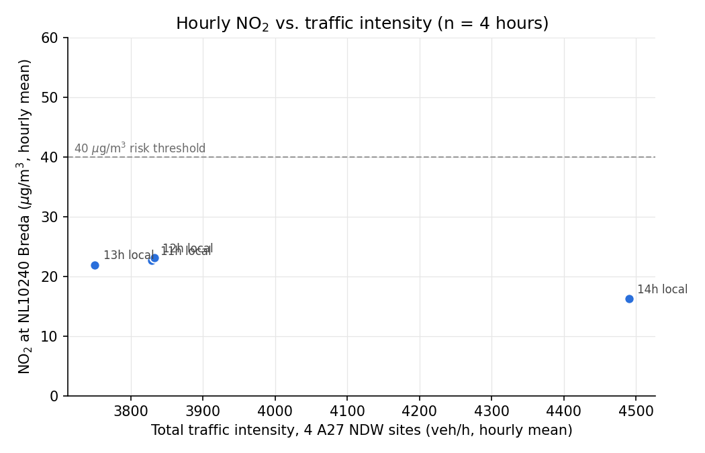



# AirBreda Architecture Design Document

MohammadAli Jaberi, Breda University of Applied Sciences (BUas), 1 October 2026.

**Contents:** [0 Overview](#overview) / [1 Architecture](#architecture) / [2 ADRs](#adrs) / [3 Trade-offs](#trade-offs) / [4 Cloud provider](#provider) / [5 Cost](#cost) / [6 Reflection](#reflection) / [7 Appendix](#appendix)

## 0. Overview {#overview}

AirBreda answers one question for the Municipality of Breda: how does A27 traffic relate to nitrogen dioxide (NO2) in Breda, and is the current hour likely to be a high-NO2 hour? It combines **Luchtmeetnet** hourly NO2 at station NL10240 (Breda-Tilburgseweg) with the **NDW** national traffic feed, from which I keep four A27 sites near hectometer 63: the two mainline carriageways (hrl, hrr) and the entry and exit slip roads (vwd, vwa).

It runs on AWS in eu-north-1 (Stockholm): one EC2 t3.micro with two cron-started ingestion containers and an always-on dashboard, RDS PostgreSQL and an S3 bucket. Dashboard: [http://13.61.230.95:8000](http://13.61.230.95:8000). Code: [https://github.com/MohammadaliJaberi244437/airbreda](https://github.com/MohammadaliJaberi244437/airbreda).

I did the five-day course in one day (1 October 2026). NDW capture started on my laptop at 10:33 local time, before any cloud resource existed; cloud ingestion has run since 11:23. With <!--N_ROWS-->4<!--/N_ROWS--> hourly rows the model is a placeholder that proves the serving path; the architecture is the deliverable.

## 1. Architecture diagram {#architecture}

<pre class="mermaid">
flowchart LR
  subgraph INTERNET["Public internet"]
    LMN["Luchtmeetnet API NO2 at NL10240, hourly"]
    NDW["NDW open data feed national XML.gz, 1.2 MB"]
    GH["GitHub repo code and model.pkl"]
    USER["Policy officer or grader"]
  end
  subgraph LAPTOP["Developer laptop, BUas network aws login: AccountFullAccessRole, short-lived"]
    CAP["capture_ndw.py every 5 min from 10:33 then backfill"]
    TRAIN["build_training_data.py train_model.py"]
  end
  subgraph AWS["AWS account, Region eu-north-1 Stockholm"]
    subgraph VPC["VPC, AZ eu-north-1a"]
      subgraph VMSG["SG airbreda-vm-sg: 22 from dev IP only, 8000 from anyone"]
        subgraph ROLE["EC2 airbreda-vm t3.micro, role airbreda-ec2-role: S3 List, Get, Put on this bucket only"]
          CRON["cron, UTC"]
          AIR["airbreda-air hourly at :25"]
          TRF["airbreda-traffic every 10 min"]
          DASH["airbreda-dashboard FastAPI :8000, model.pkl"]
        end
      end
      subgraph DBSG["SG airbreda-db-sg 5432 from vm-sg and dev IP"]
        RDS[("RDS airbreda-db PostgreSQL 18.3, TLS sensor_readings ingestion_runs")]
      end
    end
    S3[("S3 bucket airbreda-raw-339879235060 Block Public Access on, no bucket policy raw/ndw: raw feeds ndw: hourly CSVs")]
  end
  CRON --> AIR
  CRON --> TRF
  LMN -->|"last 50 hours"| AIR
  NDW -->|"every 10 min"| TRF
  USER -->|"HTTP 8000"| DASH
  NDW -->|"every 5 min"| CAP
  AIR -->|"upsert NO2"| RDS
  TRF -->|"insert"| RDS
  TRF -->|"raw feed, then CSV"| S3
  DASH -->|"read"| RDS
  DASH -->|"read, cached 60 s"| S3
  CAP -->|"backfill"| RDS
  CAP -->|"backfill"| S3
  TRAIN -.->|"read"| RDS
  TRAIN -.->|"read"| S3
  TRAIN -.->|"commit model.pkl"| GH
  TRAIN -.->|"scp over SSH, docker build on VM"| DASH
</pre>

**Trust boundaries** (SG = security group, dev IP = my developer IP):

- **airbreda-vm-sg:** SSH (22) only from my developer IP. The dashboard (8000) is open to 0.0.0.0/0 so the grader can reach it; it is plain HTTP and read-only, with no write endpoints.
- **airbreda-db-sg:** 5432 only from members of airbreda-vm-sg (a group reference, which survives a VM IP change) and from my IP; TLS required.
- **airbreda-ec2-role:** s3:ListBucket on the bucket, s3:GetObject and s3:PutObject on its objects; no delete, no other service. Containers get short-lived credentials through IMDSv2 (hop limit 2); no keys on the VM.
- **S3 bucket:** Block Public Access on, no bucket policy: only the VM role and my laptop session reach it.
- **Laptop:** `aws login` gives short-lived credentials for AccountFullAccessRole, full account access and the widest trust in the system (setup, backfill, Compose test). No long-lived access keys exist; the database password lives only in git- and docker-ignored `.env` files.
- **Code path:** code and `model.pkl` are committed to GitHub and copied from my laptop to the VM with `scp` over SSH; the VM builds all three images itself. With no registry or deploy pipeline, whoever holds the SSH key decides what the VM runs next, which is why infrastructure as code, then a build-and-deploy pipeline, are the first production additions in my reflection.

## 2. Architecture Decision Records {#adrs}

### ADR-001: Initial Data Storage Strategy {#adr-001}

**Status:** Accepted, 1 October 2026.

**Context.** Luchtmeetnet gives one NO2 value per hour, which RIVM may revise after validation. NDW gives a 70 MB national XML snapshot with no history, of which I need four sites. The system needs the latest NO2 value, run history and bad-data sums for `/health`, and ad-hoc answers, for about 430,000 rows (0.09 GB) per corridor per year.

**Decision.**

- **PostgreSQL on RDS** for clean readings: a narrow `sensor_readings` table keyed on (station_id, timestamp, component), plus `ingestion_runs`. Uniform rows, key lookups and time-range aggregates, free deduplication from the key, and one SQL statement per ad-hoc question. The training join of NO2 and traffic runs in Python (`features.py`) on purpose: the dashboard applies the same code to the same S3 CSVs, which prevents training-serving skew (ADR-006).
- **S3 for raw files.** Every NDW feed (1.2 MB gzipped) is uploaded *before* parsing, so a fixed parser can re-read history that NDW does not keep. In the database, 172 MB a day would fill the 20 GB volume in four months, at five times the per-GB price.
- **Duplicates:** traffic uses `ON CONFLICT DO NOTHING`; air uses `DO UPDATE`, deliberately: each run re-fetches 50 hours, and updating picks up RIVM's revisions while staying idempotent.

**Alternative rejected: DynamoDB.** Good at "latest value", but every other question (last hour's bad-data sum, flagged hours, skipped speed rows) becomes a query plus code, or a scan. Its strengths (scale, steady latency) buy nothing at 0.09 GB a year.

**Consequences.** Simple SQL and a re-parseable audit trail. But RDS costs EUR 15.61 a month even when idle (55% of the bill), the two stores can disagree after a failed database write (the raw file is then the recovery path), and without a lifecycle rule the bucket grows by 63 GB a year.

### ADR-002: Messaging Architecture {#adr-002}

**Status:** Accepted for the local prototype; not deployed to the cloud (see ADR-004).

**Context.** AirBreda produces about 100 messages an hour (50 per air run, which re-sends 50 hours; 8 per traffic run) for one consumer, and the database is the source of truth.

**Decision.**

- **Queue after the database write, not in front of it.** In front, a queue would keep ingestion running while the database is down, fan out and smooth bursts; at 100 messages an hour with one consumer that buys nothing and adds a failure point before the source of truth. Behind the write, it decouples future consumers (say a real-time alert) from ingestion.
- **Redis list** `readings` (`redis:7-alpine`, `docker-compose.redis.yml`), one JSON message per reading, pushed only when `REDIS_HOST` is set: one free local container, enough to test the pattern (Service Bus is Azure). In production on AWS I would choose SQS (managed, durable, dead-letter queues, IAM).
- **Broker down:** `publish_readings` logs WARNING `broker_unavailable` with the count of dropped messages and the run succeeds: messages are lost, readings never.
- **Bad data.** Luchtmeetnet values null or unchanged for 3 or more hours are flagged (`is_flagged`, WARNING `DATA_QUALITY_ERROR`) and kept: a missing hour is a hole in the series and a lost training row, training can exclude the flag, and RIVM may still correct the value. The real feed has shown neither case yet, so the path is proven by the unit tests and by a replay of the test fixture ([evidence](evidence/luchtmeetnet_stale_null.txt): four `DATA_QUALITY_ERROR` lines, the rows written with `is_flagged = TRUE` and a real SQL NULL). The flag is sticky across the overlapping 50-hour pages: an unchanged value keeps its flag, a revised value gets a fresh one. NDW speed `-1` and `dataError` lanes (placeholder zeros) are sentinels that would become fake speeds and fake zero traffic, so the speed row is skipped and counted, while intensity is still written.
- **Result:** both jobs exited 0 and published 50 and 8 messages; `LLEN readings` returned 58 ([evidence](evidence/redis_lrange.txt)); 13 tests cover the broker, including broker-down cases.

**Consequences.** The cloud writes directly to RDS, so no fan-out exists there today. Messages sent while a broker is down are lost (a consumer can catch up from RDS), and re-running a traffic job re-publishes rows the database skipped, so consumers must de-duplicate. **Starting over**, I would use one rule for both sources: keep every reading, store NULL instead of a sentinel, add a reason code. By 10:00 UTC on 1 October speed `-1` had appeared three times (09:11, 09:22, 09:36), all on the exit slip road and each in a lane with zero flow ([evidence](evidence/ndw_speed_minus1.txt)), and it keeps recurring a few times a day: it meant "no vehicle this minute", not "broken sensor", and skipping the row discarded the other lane's valid speed each time. Exclusion belongs to the consumer.

### ADR-003: Resilience Strategy {#adr-003}

**Status:** Accepted.

**Context.** A policy officer and graders open the dashboard a few times a day; no real-time safety decision depends on it. Everything runs on one VM and one Single-AZ database. The irreplaceable asset is the raw NDW archive; Luchtmeetnet can be re-fetched.

**Decision.**

- **SLO: 99%** of `GET /site/{id}` requests per rolling 30 days return HTTP 200 within 2 seconds (a degraded response with a null prediction counts as good), measured from the dashboard's request log. The error budget is 7.3 hours a month. With one VM and no one on call, a single bad deploy or AZ incident would use up the whole budget of a 99.5% SLO (3.65 hours) or a 99.9% SLO (44 minutes); those need Multi-AZ RDS, two load-balanced instances and alerting.
- **DR tier: Backup and Restore.** RDS automated backups (1 day) allow point-in-time restore with a recovery point of about 5 minutes; S3 Standard spans several AZs; the stateless VM is rebuilt from `infra/user-data.sh`, the repository, `infra/crontab.txt` and `.env` in one to two hours by hand (my estimate). Why: that rebuild fits inside the 7.3-hour budget, so the cheapest tier meets the SLO for any single VM or database failure. Only a Region outage exceeds it, which for this dashboard does not justify the next tier's cost.
- **Next tier up:** Pilot Light in eu-west-1 (Ireland) adds EUR 14.98 a month (+52%, EUR 43.56 in total) for a cross-Region read replica, a copy of the VM image and S3 Cross-Region Replication, cutting recovery to 30 to 60 minutes. A second Region also means leaving the Free plan.

**Consequences.** A Region outage costs hours of downtime and the NDW data of those hours, which I accept for a prototype. The first upgrade I would buy is S3 Cross-Region Replication alone (EUR 1.46 a month): it protects the irreplaceable data.

### ADR-004: Compute Strategy {#adr-004}

**Status:** Accepted.

**Context.** Two short jobs (about 5,100 runs a month) and, from Day 4, one always-on web app; one day to build, USD 100 of credits, a Free plan account in eu-north-1.

**Decision.** One **EC2 t3.micro** (2 burstable vCPUs, 1 GiB RAM, Amazon Linux 2023, 16 GB gp3, standard CPU credits, so no surplus charges) with Docker and **cron**: air hourly at :25 UTC, once Luchtmeetnet has published the hour (one request against a fair-use limit of 100 per 5 minutes), and traffic every 10 minutes, because six samples of NDW's 1-minute rates give a steadier hourly mean.

- **Why not a managed container service:** ECS Fargate with EventBridge Scheduler removes patching but needs a registry, task definitions and networking per service, plus a load balancer for the dashboard; Lambda fits the jobs, not the dashboard. At today's load Fargate costs EUR 35.73 a month, three times the VM: dashboard task (0.25 vCPU, 0.5 GB) 8.73, load balancer 15.88, three public IPv4 addresses 9.64, 5,110 job tasks at the 1-minute minimum 1.39, registry 0.09. Without the load balancer it is EUR 13.42, but the dashboard's address would change with every deploy.
- **Cost:** EUR 11.34 a month (USD 7.88 instance, 1.34 disk, 3.65 public IPv4).
- **At 50 corridors with 5-minute ingestion** a t3.medium (EUR 32.17) could cope, but I would move ingestion to EventBridge Scheduler with Fargate tasks or Lambda, so retries and failed-run alerts become platform features.
- **Redis was dropped:** on one VM with one consumer it adds a fourth container in 1 GiB and a service to monitor, while nothing reads the list. A second consumer (say a real-time NO2 alert) or many ingestion workers needing a buffer would bring it back, as SQS.

**Unanticipated concern: memory, not CPU.** The 147 MB NDW configuration XML would exhaust 1 GiB as a DOM, so it is archived unparsed, the 70 MB measurement feed is searched as bytes, and the VM has 2 GB of swap.

**Consequences.** Cheap, transparent and easy to debug (SSH, `docker logs`), but a single point of failure that I run myself: I patch the operating system and Docker, all containers share one pool of burst credits and 1 GiB of RAM backed by swap, a stop and start changes the public IP, and nothing scales automatically.

### ADR-005: Compute and Deployment Strategy (extends ADR-004) {#adr-005}

**Status:** Accepted. Extends ADR-004.

**Context.** Day 4 adds a FastAPI dashboard (`/site/{id}`, `/health`, an HTML page) with a scikit-learn model. Unlike the jobs, it must stay up.

**Decision.**

- **A third container on the same VM**, built from `Dockerfile.dashboard` with `model.pkl` copied in: the VM is already paid for, the load is a few requests a minute, and it reuses the instance role and the path to RDS.
- **What would change my mind:** more than a few concurrent users, an SLO above 99%, HTTPS on a domain, zero-downtime deploys, or ingestion and dashboard competing for burst credits (without credits a t3.micro drops to 10% per vCPU). Then the dashboard moves to Fargate behind a load balancer.
- **Long-term operation:** `docker run -d --restart unless-stopped -p 8000:8000 --env-file .env --memory 450m airbreda-dashboard`, capped at 450 MiB so a leak in the dashboard cannot starve the ingestion containers of the 1 GiB. Docker and crond start at boot, so after a reboot or crash the dashboard restarts and ingestion resumes at the next slot. I tested this with a real reboot on 1 October: the dashboard answered again about 75 seconds later, and crond, the schedule and the swap file came back on their own. Air gaps heal (each run re-fetches 50 hours); NDW samples from the downtime are lost.
- **What the local Compose test caught:** setting it up showed that containers cannot reuse my laptop's `aws login` session, so locally they get exported short-lived credentials, and that the dashboard turned expired credentials into a plain error instead of a 503, which I fixed before deploying. The run itself confirmed that `model.pkl` is inside the image and that all three services work together against the real RDS and S3. On the VM the instance role removes the credential problem.

**Consequences.** No new cost, no new trust boundary and one deploy procedure for all images. But the dashboard shares RAM, swap and burst credits with ingestion; it serves plain HTTP on port 8000 without TLS; a stop and start, unlike a reboot, would change an auto-assigned public IP and so the URL, which is why I attached an Elastic IP (13.61.230.95) before handing in the link; it costs the same 0.005 USD an hour as the address it replaced while attached, and must be released at teardown; and every redeploy or retrain is a `docker build` plus a restart, with seconds of downtime. **Extends, not supersedes:** one VM with Docker and cron still holds; ADR-005 adds a long-running workload class and its deployment.

### ADR-006: ML Serving Architecture {#adr-006}

**Status:** Accepted for the prototype; numbers from the final training at <!--TRAINED_AT-->15:32 on 1 October 2026 (Amsterdam time)<!--/TRAINED_AT-->.

**Context.** Target: hourly NO2 at NL10240. Features: total A27 intensity (hourly mean of the 10-minute samples, summed over four sites) and local hour of day. Training data: <!--N_ROWS-->4<!--/N_ROWS--> hourly rows (<!--TRAIN_RANGE-->hours ending 1 October 2026 10:00 UTC to 1 October 2026 13:00 UTC<!--/TRAIN_RANGE-->). Flagged hours are excluded, as are hours in which any site has fewer than 3 samples spanning 30 minutes (the coverage rule the dashboard applies too) and hours without published NO2.

**Decision.**

- **Linear regression** on `[total_intensity_veh_per_hr, hour_of_day]`: three parameters, readable coefficients, little room to memorise a handful of rows. Result: in-sample R2 <!--R2-->0.97<!--/R2-->, in-sample MAE <!--MAE-->0.37<!--/MAE--> ug/m3, intensity coefficient <!--COEF_INTENSITY-->-0.0071<!--/COEF_INTENSITY--> ug/m3 per veh/h, hour coefficient <!--COEF_HOUR-->-0.703<!--/COEF_HOUR-->, intercept <!--INTERCEPT-->58.09<!--/INTERCEPT-->. Below 10 rows there is no test set, so these numbers say nothing about predictive skill. Thousands of hourly rows with weather features would justify gradient-boosted trees.
- **no2_exceedance_risk** = 1 / (1 + exp(-0.2 x (predicted NO2 - 40))). 40 ug/m3 is the EU annual limit value (Directive 2008/50/EC) and the WHO 2005 annual guideline, applied to hourly values as a deliberate, stated mismatch: an hour above 40 is no legal exceedance but pushes the annual mean the wrong way, while the hourly limit of 200 is never approached here. A sigmoid rather than a yes/no flag, because the prediction is uncertain: 0.12 at 30, 0.5 at 40, 0.88 at 50.
- **Training-serving skew** here would be: local hour for training but UTC for serving (predictions one or two hours off); hourly means for training but one 1-minute sample for serving; or an 08:30 traffic sample joined to the NO2 row labelled 08:00, although Luchtmeetnet labels an hour by its end (09:00). One module, `features.py`, used by training and dashboard alike, prevents all three. Baking the model into the image removes another cause: code and model ship as one versioned artifact, so serving cannot load a model built with other feature code or fail on a runtime download.
- **One station, four sites:** the sites form one interchange with one air-quality context, and the model uses their sum. A second interchange needs a second station when its traffic cannot plausibly reach NL10240 (kilometres away, or usually downwind); otherwise the model learns noise.
- **If predict() fails**, `/site/{id}` still returns 200 with the real NO2 and intensity, a null prediction and risk, and a `prediction_error`, logged as ERROR: the measurements are the trustworthy part and should not vanish because the least trustworthy part failed. Only an unreachable RDS or S3 gives 503, because then nothing real is left.

**Consequences.** All four sites show the same prediction and risk next to their own intensity, and the risk is a score, not a calibrated probability. With <!--N_ROWS-->4<!--/N_ROWS--> rows the model is a placeholder, not a forecast. Retraining means rebuilding and restarting the image: model and feature code cannot drift apart, but no model changes without a deploy. A model failure costs the prediction, never the page. A second interchange needs its own station mapping and model.

## 3. Trade-off justifications {#trade-offs}

**Storage type.** Considered DynamoDB, S3 with Athena and RDS PostgreSQL; chose RDS plus S3. Given up: the cheapest option, as RDS costs EUR 15.61 a month for 0.09 GB a year. Gained: the latest-NO2 lookup runs in about 0.1 ms inside RDS (EXPLAIN ANALYZE, 0.07 to 0.13 ms across runs; 29 ms round trip from my laptop, while the VM shares the database's AZ), `/health` is a 0.14 ms aggregate, and the key blocks duplicates; Athena needs seconds per query. The 63 GB of raw files after a year cost EUR 1.27 a month in S3.

**Compute choice.** Considered Fargate with EventBridge Scheduler, Lambda and one VM; chose a t3.micro at EUR 11.34 a month against EUR 35.73 for Fargate with a load balancer. Every scheduled job run so far ended 3 to 5 seconds after its cron slot, container start included (`ingestion_runs`), so the CPU works about 30 seconds an hour, and `/site/{id}` answers in about 20 ms when its 60-second cache is warm and about 200 ms on a cache miss (curl on the VM) (request log). Given up: managed restarts, retries and patching, and memory headroom.

**Messaging pattern.** Considered direct writes, a Redis list and SQS; chose direct writes in the cloud, Redis as a tested prototype. About 100 messages an hour for one consumer leave nothing to smooth. Freshness comes from the sources: NO2 lands about 25 minutes after its hour ends (the 10:25 UTC run finished 4 seconds after its slot) and traffic is at most 10 minutes old plus a 60-second cache; a direct write adds no hop, a queue adds the consumer's polling delay. Given up: decoupling and a replayable stream.

**DR strategy.** Considered Backup and Restore (EUR 28.58 a month), Pilot Light in Ireland (EUR 43.56), Warm Standby (EUR 55.52) and in-Region Multi-AZ RDS (+EUR 13.04, covering an AZ only); chose Backup and Restore: recovery in 1 to 2 hours, a recovery point of about 5 minutes for RDS, the NDW hours of an outage lost, where Pilot Light recovers in 30 to 60 minutes. Given up: surviving a Region outage without hours of downtime. Paying 52% more every month for a dashboard read a few times a day is not proportionate.

## 4. Cloud provider rationale for the Municipality of Breda {#provider}

*For a policy officer, without technical terms.*

AirBreda runs on Amazon Web Services (AWS). We rent three things by the hour: a small computer that collects the data and shows the dashboard, a database for the measurements, and storage that keeps an exact copy of every traffic file we download. We buy no hardware; AWS looks after the buildings, power, spare parts and database backups. Today this costs about EUR 29 a month, paid from free starting credits, and it can be stopped at any time.

Why it suits a Dutch municipality:

- **The data stays in the European Union.** Everything runs in AWS data centres in Stockholm, Sweden, under European privacy law (GDPR, in Dutch the AVG). AirBreda holds no personal data, only air measurements and anonymous traffic counts that are already public.
- **Recognised security standards.** AWS is certified against ISO 27001, the standard the Dutch government's security baseline (BIO) builds on. That eases the municipality's own security check.
- **Locked-down access.** Only the AirBreda computer and the developer can read and write the stored files or reach the database, and no permanent passwords for the cloud account are kept on that computer.
- **Costs grow in small steps:** about EUR 37 a month for ten corridors and EUR 97 for fifty (a corridor is one stretch of motorway with its nearest air-quality station).

One honest concern: AWS is an American company. Under the US CLOUD Act, American authorities can in some cases demand data from American providers, even when it is stored in Europe. For open air and traffic data the risk is small; it would matter if the system ever held information about residents.

What we would lose by switching: not the data and not the software. AirBreda is built from standard parts that many suppliers support (a common operating system, a common database and plain files), so it could move to another cloud, including a European one, in days rather than months. A year of raw files (about 63 GB) fits within the 100 GB a month that AWS lets us download free. We would have to redo the setup around the system (access rules, backups, the code that talks to AWS storage) and test everything again.

## 5. Cost estimate {#cost}

| EUR per month (eu-north-1, on-demand, 730 h) | Current (1 corridor) | 10 corridors | 50 corridors |
|---|---|---|---|
| Compute (VM) | 11.34 (t3.micro, 16 GB gp3, 1 public IPv4) | 18.28 (t3.small, 16 GB gp3, 1 public IPv4) | 32.17 (t3.medium, 16 GB gp3, 1 public IPv4; 5-min ingestion) |
| Database | 15.61 (db.t4g.micro Single-AZ, 20 GB gp3, 1-day backups free, 1 public IPv4) | 15.61 (as current) | 50.29 (db.t4g.medium Single-AZ, 50 GB gp3, 1-day backups free, 1 public IPv4) |
| Object storage | 1.63 (S3 Standard, 62.7 GB at month 12, 66k PUT/LIST and 197k GET a month) | 2.94 (63.0 GB, 223k PUT/LIST, 1.93M GET) | 15.02 (128.2 GB, 1.98M PUT/LIST, 10.5M GET) |
| **Total** | **28.58** (USD 32.45) | **36.83** (USD 41.83) | **97.48** (USD 110.68) |

**One VM at 10 corridors?** Yes: NDW is one national file per run whatever the corridor count, so growth is only 40 CSV writes and 10 Luchtmeetnet calls per run, and the t3.small is for RAM headroom only.

**One VM at 50 corridors?** No: it would still run, but one VM would be the single point of failure for 50 corridors and the dashboard, so I would move scheduling to EventBridge with Fargate or Lambda and batch the per-site S3 writes, whose requests (EUR 12.42) already cost more than storage.

**Sources.** AWS Price List API (`aws pricing get-products`) for eu-north-1, queried 1 October 2026, for example (USD) t3.micro 0.0108 and db.t4g.micro 0.016 per hour, public IPv4 0.005 per hour, S3 Standard 0.023 per GB-month. Official pricing pages (select Europe (Stockholm)): [EC2](https://aws.amazon.com/ec2/pricing/on-demand/), [EBS](https://aws.amazon.com/ebs/pricing/), [RDS for PostgreSQL](https://aws.amazon.com/rds/postgresql/pricing/), [S3](https://aws.amazon.com/s3/pricing/), [public IPv4](https://aws.amazon.com/vpc/pricing/), [Fargate](https://aws.amazon.com/fargate/pricing/), [load balancing](https://aws.amazon.com/elasticloadbalancing/pricing/). ECB rate of 30 September 2026: 1 EUR = 1.1355 USD. Every calculation, including DR, Multi-AZ and Fargate: [evidence/cost_model.py](evidence/cost_model.py).

**Assumptions:** list prices, Linux, 730 hours a month, no VAT, credits not subtracted; public IPv4 for the VM and the database; a corridor is 4 NDW sites plus 1 station, 429,240 rows (0.09 GB) a year; 1-day backups within the free allowance; S3 at month 12 without a lifecycle rule, from object sizes measured in the bucket. Check: USD 32.45 a month is USD 1.07 a day, matching the observed bill of about USD 1 a day.

## 6. Reflection {#reflection}

My least confident decision is the core modelling assumption: that A27 traffic at hectometer 63 explains NO2 at Breda-Tilburgseweg, so one station serves all four sites and traffic plus hour are the only features. I chose it because it was the pairing I could build and test in a day, not because data showed it. With <!--N_ROWS-->4<!--/N_ROWS--> rows the model cannot separate traffic from time of day, weather or the regional background: on a calm morning NO2 rises with or without the motorway. Three things would make me confident: months of data with KNMI wind direction, where the traffic effect should be clearly larger when the wind blows from the A27 to the station; a background station away from the motorway as a control; and a held-out test in which the model beats a naive baseline such as the same hour last week.

With a full year of data I would change three things. Features: wind speed and direction, temperature, day of week, holidays, congestion (speed), and hour of day as a cycle (sine and cosine), since NO2 has morning and evening peaks that a linear hour term cannot express. Algorithm: gradient-boosted trees, which learn interactions such as "traffic matters when the wind is from the east", with linear regression as the baseline to beat. Evaluation: a time-based split (train on nine months and test on three, or a rolling origin), never a random one, because neighbouring hours are near copies and would leak. I would report MAE against the naive baseline and, for the risk score, its calibration and how many real hours above 40 it catches.

The first thing I would add for real production is infrastructure as code (Terraform or CloudFormation) for the security groups, role, VM, database and bucket. I built the stack by hand in one day, and Backup and Restore (ADR-003) is only as good as how fast I can rebuild; today those steps live in `infra/` and my shell history. Next would come CD: the pytest workflow already runs on every push (`.github/workflows/tests.yml`); what is missing is building the three images and deploying them.

Starting the NDW capture at 10:33, before any cloud resource existed, was the best decision of the day, because every uncaptured hour is gone for good. The most useful lesson came from a bug: my `.env` loader matched `[A-Z_]`, silently skipped `S3_BUCKET` because of the digit, and a run quietly wrote to a local folder instead of S3. Nothing failed, and that was the problem. Production configuration should fail loudly when a required setting is missing.

## 7. Appendix {#appendix}

**Lab notebook:** every reflection, estimation and wrap-up question of the five days, answered from the real system and live API calls: [notebook](notebook/).

**Endpoints, how to run and how to deploy:** see the repository's README ([https://github.com/MohammadaliJaberi244437/airbreda](https://github.com/MohammadaliJaberi244437/airbreda)).

**Evidence:** [Redis lab output](evidence/redis_lrange.txt) (`LLEN readings` = 58); [the three speed `-1` samples](evidence/ndw_speed_minus1.txt) with their `ingestion_runs` rows; [the Luchtmeetnet stale and null replay](evidence/luchtmeetnet_stale_null.txt); [all cost calculations](evidence/cost_model.py); the [training data plot](img/no2_vs_intensity.png); on the VM, `~/airbreda/logs/air.log` and `traffic.log` (one JSON object per line), the dashboard's request log (`docker logs`) and the `ingestion_runs` table.


